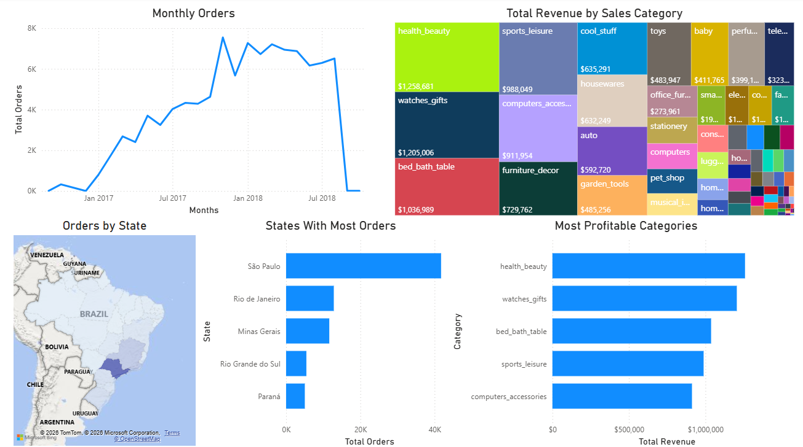
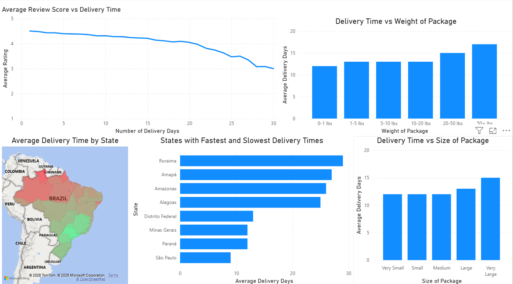

# Brazilian-Ecommerce-Delivery-Performance-Analysis
This project analyzes the Brazilian Olist e-commerce dataset to identify trends in order demand, logistics performance, and customer satisfaction. The original CSV files were imported into PostgreSQL, where SQL queries were used to transform the relational dataset into analytical tables designed to answer business questions. These tables were then connected to Power BI to build interactive dashboards that visualize trends in demand, delivery performance, and customer satisfaction.

## Dataset
-  Brazilian E-Commerce Public Dataset by Olist: https://www.kaggle.com/datasets/olistbr/brazilian-ecommerce

## Tools Used 
-  PostgreSQL – data querying and transformation
-  Power BI – data visualization and dashboard creation
-  SQL – aggregations and analysis queries

## Insights
-  Delivery speed has a strong impact on customer review scores.
-  Very large (high volume) or heavy packages experience noticeably longer delivery times.
-  Order demand is heavily concentrated in southeastern Brazil.
-  A small number of product categories generate a disproportionate share of total revenue.

## Demand & Revenue Dashboard

## Logistics Dashboard

## Business Recommendations
-  Consider establishing a new shipping facility in Northeastern Brazil. Several states in this region show relatively high order volume but significantly longer delivery times.
-  Consider new shipping methods that reduce the delivery time of larger and heavier packages. 

